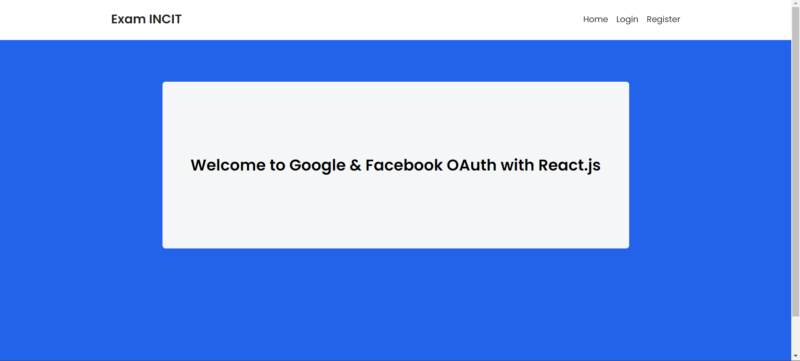

<h1 align="center">Full Stack Exam - INCIT</h1>

<div align="center">

&nbsp;
&nbsp;
&nbsp;
&nbsp;
&nbsp;
&nbsp;
&nbsp;
&nbsp;
&nbsp;
&nbsp;

</div>

## Project Description

This project is a Full Stack Exam built for the purpose of a coding test at INCIT. The application consists of two main parts: the frontend and the backend. Each part has its own documentation that can be found within the respective directory.

## Project Structure

- `Frontend/`: Contains the source code for the frontend application. Built with React and managed using Vite.
- `Backend/`: Contains the source code for the backend API. Built with Node.js, Express, and Prisma as the ORM.

## Setup and How to Run the Project

### 1. Clone the Repository

First, clone the repository to your local machine:

```bash
git clone https://github.com/alifsuryadi/full-stack-exam-incit.git
cd full-stack-exam-incit
```

### 2. Running the Frontend

1. Navigate to the frontend directory:

   ```bash
   cd Frontend
   ```

2. Read further instructions in the [Frontend/README.md](Frontend/README.md) file.

### 3. Running the Backend

1. Navigate to the backend directory:
   ```bash
   cd Backend
   ```
2. Read further instructions in the [Backend/README.md](Backend/README.md) file.

## Overview

### Dashboard



### Login


### Sign-in wiht Google


### Continue


### Profile


## Additional Notes

> Make sure to follow the instructions within each `README.md` file located in the `Frontend/` and `Backend/` directories for further configuration, including setting up environment variables `(.env.local)`, database migrations, and more.
